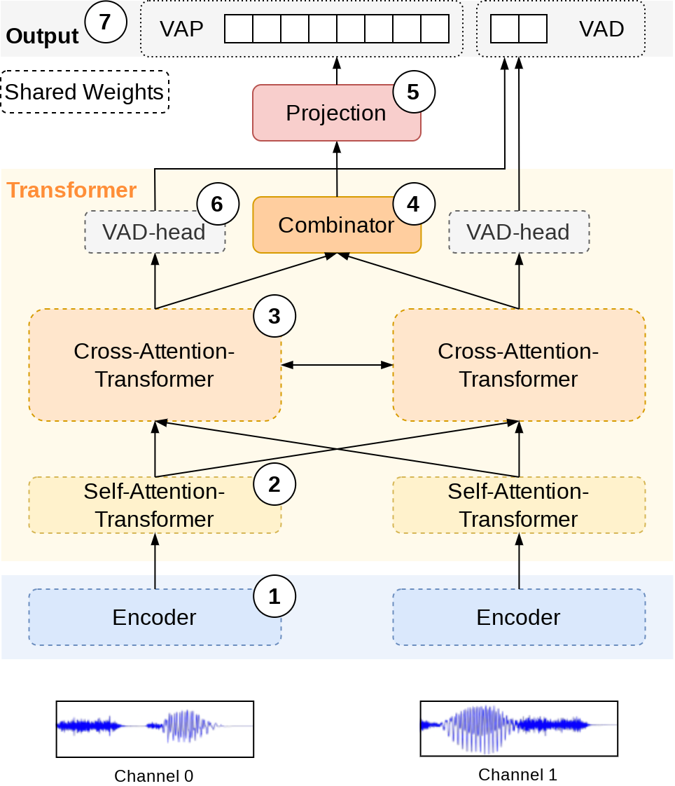

# VoiceActivityProjection

Voice Activity Projection is a Self-supervised objective for Turn-taking Events. This is an extended version which trains a stereo model (mono is still possible) that does not require any VAD information as input BUT do require separate channels for both speakers. Overbleed between the channels is fine as long as you have access to the VAD information (used as label during training). The stereo model greatly simplifies inference where the only input is a stereo waveform. The model is trained on a multitask loss defined by the original VAP-objective and a VAD-objective (predict the current voice activity over each frame for the two separate channels).

## Installation
* Create conda env: `conda create -n vap python=3.10`
  - source env: `conda source vap`
  - Working with `python 3.10` but I don't think it matters too much...
* PyTorch: `conda install pytorch torchvision torchaudio pytorch-cuda=11.8 -c pytorch -c nvidia`
    - Have not tested all versions but should work from `torch 2.0.1` as of time of writing...
* Install **`VAP`** (this repo):
  * cd to root directory and run:
    * `pip install -r requirements.txt`
    * `pip install -e .`

### VapStereo





1. Audio encoder
    - (Default) [CPC facebookresearch](https://github.com/facebookresearch/CPC_audio))
    - Causal / incremental
2. Self attention
    - (Default) 1 layer
    - Shared weights
3. Cross attention between speakers
    - (Default) 3 layers 
    - Shared weights
4. Combine the output from the two channels
    - The model is channel agnostic and used for both channels
5. Linear projection layer
    - Map to VAP vocabulary/states
6. Voice activity detection
    - Predict the voice activity for both channels independently
    - Good for "bleed-over", background noise, etc
7. VAP objective
    - 256 states
    - Representing the next 2s of dialog

The model is a GPT-like transformer model, using [AliBI attention](https://ofir.io/train_short_test_long.pdf), which operates on pretrained speech representation (extract by submodule defined/trained/provided by [CPC facebookresearch](https://github.com/facebookresearch/CPC_audio)).
A state-dict tensor is included in the `examples/` folder:
* `example/VAP_3mmz3t0u_50Hz_ad20s_134-epoch9-val_2.56.pt`

## Training

Training is done with the `main.py` script that uses [hydra](hydra.cc), read more about the data (csv-files) in [vap/data/README.md](vap/data/README.md).
Look into the default config in [vap/conf/default_config.yaml](vap/conf/default_config.yaml) to get started. Entries that exists in the config can be
changed by `python vap/main.py datamodule.num_workers` but other entries you could add requires a '+' sign `python vap/main.py +trainer.limit_val_batches=0.5`.

* **SEE `/scripts/finetune.bash` or `/scripts/train.bash` or `/scripts/eval.bash`**

As an example:
```bash
python vap/main.py \ 
    datamodule.train_path=example/data/sliding_train.csv \ 
    datamodule.val_path=example/data/sliding_val.csv \ 
    datamodule.num_workers=12 \ 
    datamodule.batch_size=10
```

#### Load checkpoint

Both the `state_dict.pt` and `checkpoint.ckpt` are 'loadable' with `torch.load()` the extensions are arbitrary.

```python 
from vap.modules.lightning_module import VAPModule

# Load entire module (includes metrics, optimizers, epochs, ...)
module = VAPModule.load_from_checkpoint("/PATH/TO/checkpoint.ckpt")
# type(module) -> vap.modules.lightning_module.VAPModule

# Load only the `VAP` model
model = VAPModule.load_model("/PATH/TO/checkpoint.ckpt")
# type(model) -> vap.modules.VAP.VAP

# Load raw state dict (model)
from vap.modules.VAP import load_model_from_state_dict

# WARNING: The `load_model_from_state_dict` tries to automatically detect the dimension/layers in the model which may break (?)
model = load_model_from_state_dict("/Path/to/state_dict.pt")
# type(model) -> vap.modules.VAP.VAP

# If you know the sizes (you should) and the above approach fails then do
from vap.modules.encoder import EncoderCPC
from vap.modules.modules import TransformerStereo
model = VAP(
    encoder=EncoderCPC(), 
    transformer=TransformerStereo(**correct_shapes)
)
# type(model) -> vap.modules.VAP.VAP
```

## Barebones parameters

* **SEE code in `/scripts/checkpoint_to_state_dict.py`**

```bash 
python scripts/checkpoint_to_state_dict.py \ 
    --checkpoint runs_new/VAP2/lh55ur9z/checkpoints/epoch=5-step=16085.ckpt \ 
    --state_dict /OUTPUTP/TO/state_dict.pt # default model_state_dict.py
```

## Citation

```latex
@inproceedings{ekstedt22_interspeech,
  author={Erik Ekstedt and Gabriel Skantze},
  title={{Voice Activity Projection: Self-supervised Learning of Turn-taking Events}},
  year={2022},
  booktitle={Proc. Interspeech 2022},
  pages={5190--5194},
  doi={10.21437/Interspeech.2022-10955}
}
```

```latex
@inproceedings{ekstedt-skantze-2022-much,
    title = {How Much Does Prosody Help Turn-taking? Investigations using Voice Activity Projection Models},
    author={Erik Ekstedt and Gabriel Skantze},
    booktitle = {Proceedings of the 23rd Annual Meeting of the Special Interest Group on Discourse and Dialogue},
    month = {9},
    year = {2022},
    address = {Edinburgh, UK},
    publisher = {Association for Computational Linguistics},
    url = {https://aclanthology.org/2022.sigdial-1.51},
    pages = {541--551},
}
```
